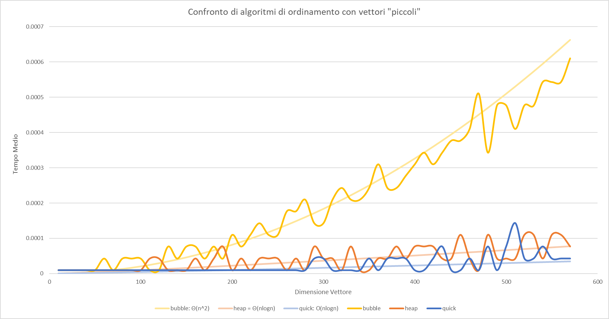

# LEZIONE 2018/11/21 - BENCHMARK
##### Gabor Galazzo 20024195 A.A. 2018/2019

Il programma *benchmark* permette di effettuare un test di valutazione delle performance effettive degli algoritmi di ordinamento **bubble_sort**, **heap_sort** e **quick_sort**.

> Uso: ./benchmark.exe `n_runs` `max_dim` `step` `filename`

L'applicativo procede con un <span style="color:lightblue">for</span> da *i* = 0 a `max_dim` con un passo di `step`; per ogni algoritmo di ordinamento genera `n_runs` array di interi di dimensione *i* li ordina e salva la media di ogni algoritmo con formato csv sul file `filename`.


## Scelte progettuali
Al fine di migliorare la "bontà" dei dati si è optato per generare da input dell utente il test di banchmark. tramite un'apposita funzione *dinamica*.
L'implementazione degli algoritmi si basa sui lucidi.

```c
void banchmark(int runs, int max, int step, char* filename, void (*func_ptr[])(int *, int), int n)
{

    FILE *fp = fopen(filename, "wt");
    fprintf(fp, "dim,suns,");
    for (int i = 0; i < n-1; i++)
        fprintf(fp, "%d,", i);
    fprintf(fp, "%d\n", n-1);
    for (int i = 0; i <= max; i+=step)
    {
        double times[n];
        for(int p = 0; p<n; p++)
            times[p] = 0;
        for (int j = 0; j < runs; j++)
        {
            int *test_a = random_array(i);
            for (int k = 0; k < n; k++)
            {
                struct timeval start, end;
                int *to_test = copy_array(test_a, i);
                gettimeofday(&start, NULL);
                func_ptr[k](to_test, i);
                gettimeofday(&end, NULL);
                assert(check_sort(to_test, i)); //Controlla che effettivamente l'array sia ordinato
                times[k] += (end.tv_sec + end.tv_usec*1e-6) - (start.tv_sec + start.tv_usec*1e-6) + 0.00001;
                free(to_test);
            }
        }
        fprintf(fp, "%d,%d,",i, runs);
        for (int p = 0; p < n-1; p++)
            fprintf(fp, "%lf,", (times[p]/runs));
        fprintf(fp, "%lf\n", (times[n-1]/runs));
    }
    fclose(fp);
}

int main(int argc, char* argv[])
{
    /*...*/
    void (*func_ptr[3])(int *, int) = {bubblesort, heapsort, start_qsort};
    banchmark(/*...*/, func_ptr, 3);
}

```

## Risultati Finali




