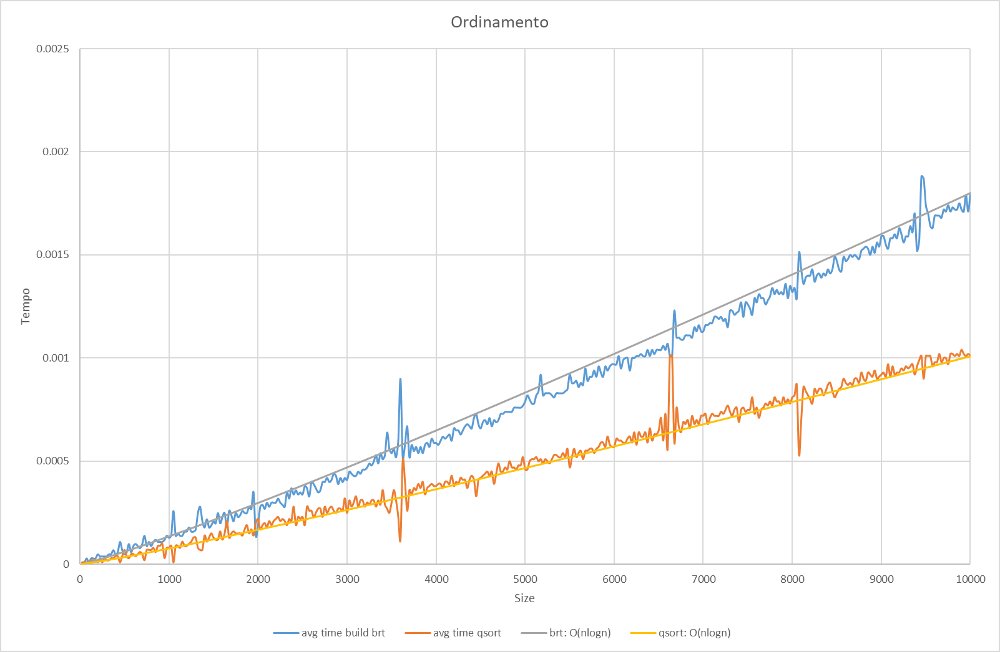
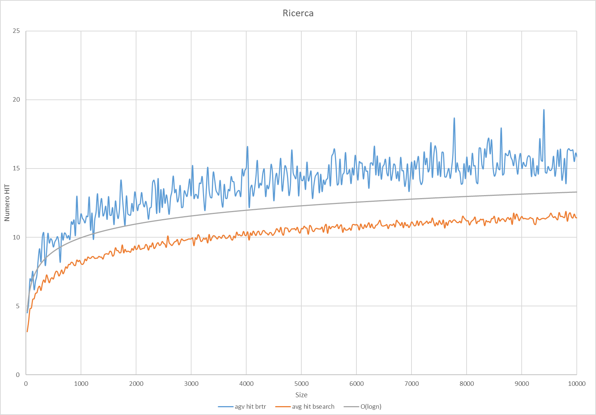

# LEZIONE 2018/12/15 - ALBERI BINARI DI RICERCA
##### Gabor Galazzo 20024195 A.A. 2018/2019

## Risultati Finali

#### Per una migliore comprensione si consiglia di visualizzare il file [Benchmark_graphs.xls](doc/Benchmark_graphs.xlsx)

##### Le curve di asintotico sono realizzate applicando un restringimento del codominio basato sugli ipotetici valori di T(n)

