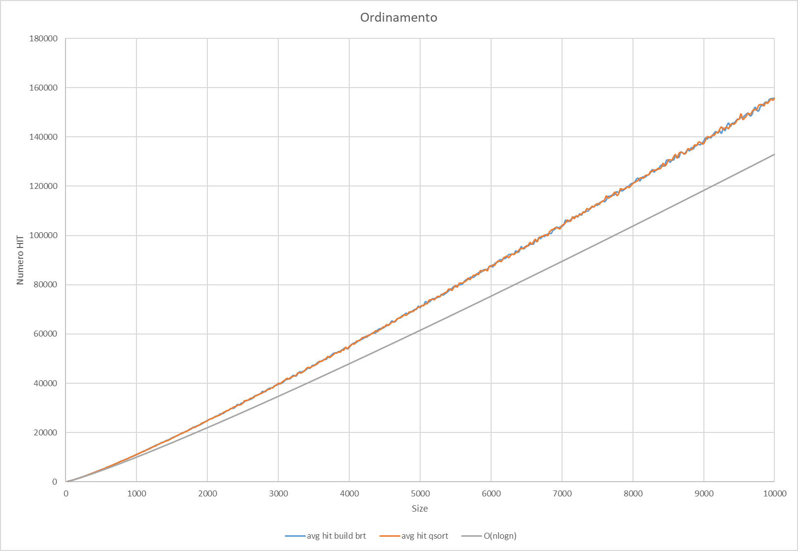

# LEZIONE 2018/12/05 - ALBERI BINARI DI RICERCA
##### Gabor Galazzo 20024195 A.A. 2018/2019

Il programma *brt* permette di effettuare un test di valutazione delle performance effettive di ordinamento di un vettore mediante **quick_sort** o costrusione di **Albero Binario di Ricerca** e ricerche su essi.

> Uso: ./brt `n_array` `n_ricerche` `max_dim` `step`

L'applicativo procede con un for da *i* = 0 a `max_dim` con un passo di `step`; crea `n_array` array disordinati e li riordina tramite **ABR** o **quick_sort** e calcola la media del *tempo si esecuzione* e *numero di HIT*.
Infine per `n_ricerche` volte effettua ricerche tramite **ricerca dicotomica** calcolando la media del *numero di HIT*

## Risultati Finali

#### Per una migliore comprensione si consiglia di visualizzare il file [Benchmark_graphs.xls](doc/Benchmark_graphs.xlsx)

##### Le curve di asintotico sono realizzate applicando un restringimento del codominio basato sugli ipotetici valori di T(n)

## Commenti e considerazioni sui grafici ottenuti

#### Come trovate l’idea di usare un albero binario di ricerca come struttura per l’ordinamento e la ricerca efficiente di chiavi?
> Direi che è molto eficente dato che da la possibilità di effettuare ordinamenti in  e ricerche in  potendo sfruttare un allocazione dinamica

### Quale complessità teorica (in notazione O) avrà la nostra tecnica di ordinamento mediante ABR?

> 

### Avete notato differenze tra le performance di ricerca tra ABR e ricerca binaria, nonostante abbiano la stessa complessità teorica?

> Si: come si può notare dalla fig. 3 la ricerca all'interno di un **ABR "normale"** è molto più instabile e irregolare del **quick_sort**

### Se ci fossero differenze, quali potrebbero essere i motivi di queste differenze?

> Le differenze ci sono: il problema principale e che un ABR o dei suoi sottoalberi, in certi casi, possono degenerare in una lista, facendo tendere la ricerca ad una complessità 

### Quale soluzione funziona meglio nella pratica, tenendo conto sia del caso medio, sia del caso peggiore? Quale scegliereste nella pratica?

> Nella pratica valuterei quale esigenza è più importante: se avere la ricerca veloce o adottare una struttura dinamica. Quindi se effettuo **più ricerche** e meno modifiche opterei per usare un **vettore ordinato**, altrimenti se mi vengono richeste meno ricerche ma **molte modifiche** opterei su un **ABR**